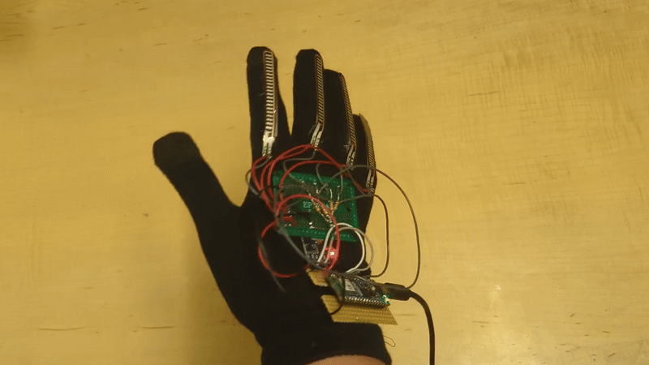

# Latent Gloves

Latent Gloves is a wearable Digital Musical Instrument (DMI) designed for the embodied exploration of neural audio latent spaces through hand gestures. The instrument combines a DIY glove-based controller, embedded sensor processing, and a neural audio synthesis engine based on the nn~ Max package to transform a vocal audio recording using a RAVE timbre transfer model.

## Build your own glove

[Read the building guide](how_to_build_your_own_glove.md)

## Software Requirements

* Max 8 or later
* Arduino IDE
* [nn~ Max Package](https://forum.ircam.fr/projects/detail/nn/)
* Download pretrained RAVE model [models by Shuoyang Zheng](https://huggingface.co/shuoyang-zheng/jaspers-rave-models/blob/main/gtsinger_b2048_r44100_z16_noncausal.ts)
* Place downloaded model in nn~ models folder

## Instructions for playing the instrument

1. Put the glove on and connect it via to the PC via USB

_2. Connect MIDI Interface to PC (if additional control is wanted)_

3. Open `Arduino/Latent_gloves/Latent_gloves.ino` on Arduino IDE

4. (Calibration) While holding the hand in a neutral, horizontal position with fingers extended and the palm facing the floor, run the code.

5. Open the Serial Monitor to check if the calibration ran without errors

6. Close Serial Monitor

7. Open `Max/Latent Gloves.maxpat` Max Patch in Max and follow instructions on screen

Steps 3-6 can be bypassed once the code is already stored in the Arduino. 
In that case, pressing the reset button on the board while holding the hand in a neutral position is advised.

## Acknowledgments
* Max Patch is `Max/Latent Gloves.maxpat` based on examples of acid-ircam's [nn~ Max Package](https://github.com/acids-ircam/nn_tilde)
* Pre-trained RAVE model downloaded from [Shuoyang Zheng's pre-trained RAVE models](https://huggingface.co/shuoyang-zheng/jaspers-rave-models)
* Max Patch test `Max/Tests/Latent Gloves - regression test.maxpat` is based on [FluCoMa's tutorial, Controlling a Synth using a Neural Network](https://learn.flucoma.org/learn/regression-neural-network/)
* Arduino MPU6050 code in `Arduino/Latent_gloves/Latent_gloves.ino` based on examples of [Adafruit's MPU6050 library](https://docs.arduino.cc/libraries/adafruit-mpu6050/)
* Arduino Kalman filter code in `Arduino/Latent_gloves/Latent_gloves.ino` based on [Kristian Lauszus (TKJ Electronics) implementation](https://github.com/TKJElectronics/KalmanFilter/blob/master/Kalman.cpp)
