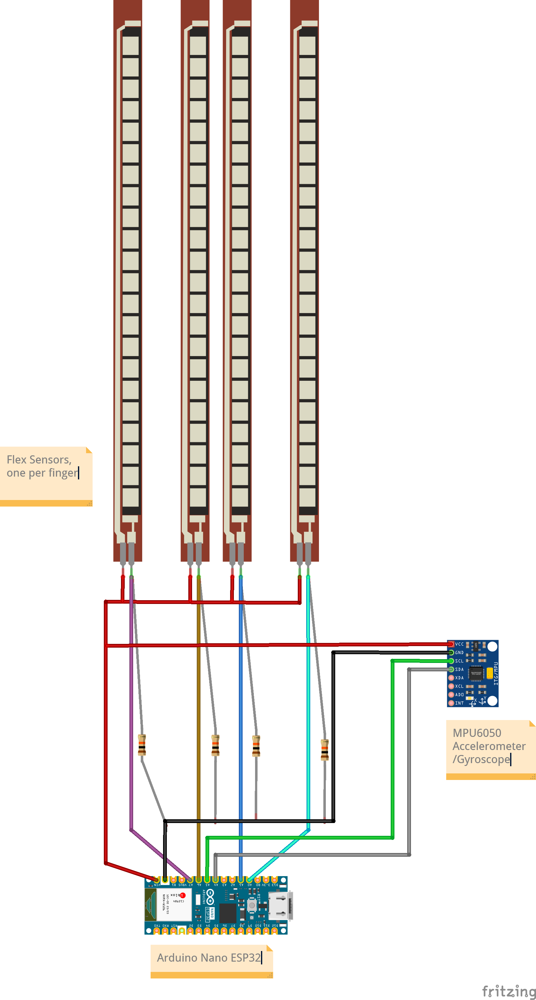
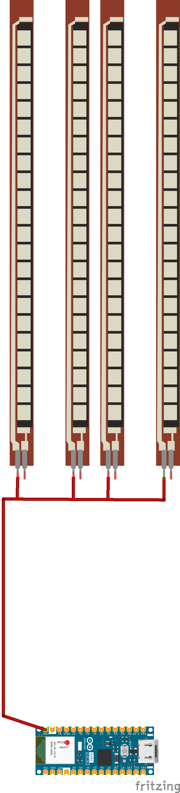
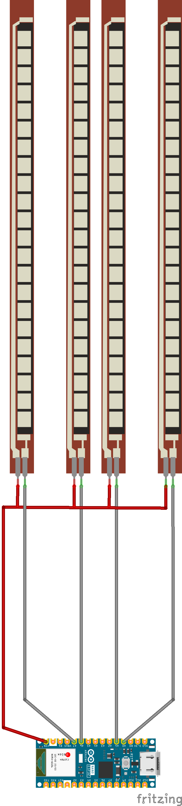
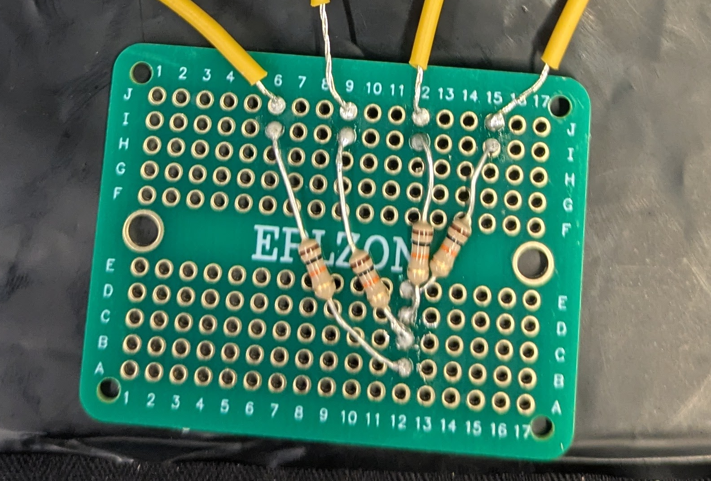

# How to build your own Latent Glove
We present instructions for building the prototype of Latent Glove in its two versions: first, the fully functional cabled version, and second, the not yet fully functional conductive thread version.

## Required materials
- One glove (Suggested: lightweight material that doesn't produce too much heat, such as cotton). [e.g. Migliore Wear Cotton Gloves for Eczema - 2 pairs £8.99](https://www.amazon.co.uk/Migliore-Wear-Touchscreen-Moisturising-Sleeping/dp/B0BKSBNF5M?th=1)
- Arduino Nano ESP32 board. [Board without headers - £14.96](https://www.amazon.co.uk/Arduino-ESP32-Without-Header-ABX00092/dp/B0C947C9QS/ref=sr_1_3_sspa)  _The controller can be built with another ESP32 board, but the code and schematic will probably need some adjustments_ 
- 4 flex sensors. [e.g. 5 pack £24.56](https://www.amazon.co.uk/MQODLFP-Manipulator-Electronic-Accessories-Flex2-2Inch)
- 1 MPU 6050 Accelerometer/Gyroscope module. [e.g. 4 pack £10.99](https://www.amazon.co.uk/JZK-MPU-6050-gyroscope-accelerometer-Raspberry/dp/B07Y9KL5Q1/ref=sr_1_7)
- 4 10kΩ resistors
- Crocodile cables
- Multicore cable of different colours (e.g.: black, red, grey)
- Heatsink
- Stripboards
- Wire stripper
- Soldering iron
- Fabric glue
- Thread and needles
- Multimeter

- **For the not-yet functional conductive thread version:** Conductive thread (Madeira high-conductive HC 12 recommended, it must be solderable), several pieces of fabric and fabric scissors

## Schematic 

Schematic including all connections:

## Cabled version

You can build this version of the controller: 

_Note: checking connections with the multimeter is suggested at each stage_

1. Glue the flex sensors to the glove with fabric glue (Tip: use only a couple of drops to keep it in place, you might need to adjust it later)
2. Following the schematic and the detailed instructions below, you will build the whole circuit.

### Connections in stripboard
#### VCC (red cables):
  - All flex sensors need to be connected to VCC. Use a connected row of the stripboard for this purpose, but we will not be soldering the cables to the sensor at this point.
  - You'll need to solder 5 cables as outputs from this row: four will go to each one of the flex sensors, and one will go to the MPU6050 module.
  - You'll need to solder 1 cable that will be an input in this row (powered by the Arduino VCC pin).
 

#### Flex Sensor reading (gray cables):
  - For each flex sensor, solder a gray cable to the stripboard to the free terminal. Note that different sensors should not be interconnected.
  - Each one of the gray cables will be later connected to the Arduino at the appropriate pin.

#### Pull-down resistors (gray cables)**
  - For each flex sensor, solder a new gray cable to the strip board **at the same potential** as before.
  - Solder the gray cable to a 10kΩ resistor
  - The other terminal of the resistor is common to all resistors and will be later connected to GND, so solder them to be connected by the stripboard.
 

#### **GND (black cables)**:
  - To the common potential point for the resistors above, solder one black cable that will later go to the Arduino GND pin.
  - Solder a second cable to this point, that will later go to the MPU6050 module.

 
#### Individual flex sensor test
Check the connections are OK using the multimeter (continuity and not short circuits!).
One by one, and using crocodile cables, connect the cables in soldered to the stripboard to the Arduino or to the flex sensor, accordingly. 
Connect the Arduino to the PC, run the code and check if that sensor is working. If it's not, check the connections!
**Doing this now will help you prevent later issues and save time.**

#### Soldering the connections to flex Sensors
- Sew the stripboard to the glove in place (the dorsal part of the hand, leaving room for the MPU6050 module).
- Solder one red cable to each of the flex sensors.
- Solder the two corresponding gray cables to the free terminal of each flex sensor.

#### All flex sensors soldered test
Connect the one red and one black cable to the VCC and GND pins of the Arduino, respectively, using crocodile cables.
Connect the Arduino to the PC, run the code and check everything is working. If it's not, check the connections!

### Soldering the connections for the MPU6050 accelerometer/gyroscope module
- Solder one red cable to the VCC pin of the MPU6050 module.
- Solder one black cable to the GND pin of the MPU6050 module.
- Solder two new cables (of a different colour) to the SCL and SDA pins of the MPU6050 module, keeping in mind that they should be long enough to reach pins A5 and A4 of the Arduino.

#### MPU6050 test
Connect the one red and one black cable to the VCC and GND pins of the Arduino, respectively, using crocodile cables.
Connect the Arduino to the PC, run the code and check everything is working. If it's not, check the connections!

#### Sewing MPU6050 in place
- Sew MPU6050 in place.

#### Soldering connections and fixing the Arduino in place
- Choose how you want to fix the Arduino in place:
    - I choose to solder it to a stripboard and route all connections through there to make the controller more robust
    - You could also sew the Arduino in place and later directly solder every connection to the board. Note that this could cause some tension in the connections when moving so proceed with care!
- Looking at the schematic carefully, solder each cable to the corresponding Arduino pin (through a stripboard, or directly, according to the choice above):
    - Flex sensors (gray cables) are connected through pins A7, A6, A1 and A0
    - MPU6050 is connected through A5 and A4 (SCL and SDA pins respectively)
    - GND (black cable) and VCC (red cable) are connected to the respective pins in the Arduino
- Sew the stripboard or the board to the glove

## Conductive thread version (not succesfully working yet!)

1. Glue the flex sensors to the glove with fabric glue (Tip: use only a couple of drops to keep it in place, you might need to adjust it later)

2. We will create **layers with different connections**. First, the **VCC layer**:
    - Sew 4 vertical lines of conductive thread, each one will go to one sensor
    - On the top end of each line, solder to the corresponding sensor (tip: use heatsink to prevent short circuits)
    - On the lower end end of each line, solder to the stripboard. All the connections should go to the same potential in the stripboard.

It should look like this:

- Test connections with the multimeter before continuing!
- If everything is OK, solder a red cable to the stripboard, connected to the previously soldered threads. It should be long enough to reach the Arduino on the wrist.

3. Now, the **GND layer**. 
    - Place a cloth panel between the previous layer and this one to prevent short circuits
    - In a new panel, sew 4 vertical lines of conductive thread, each one will go to one sensor
    - The top end of each line needs to be soldered to the free terminal of the sensor (tip: use heatsink, or this will surely touch the previous connections).
    - Grab a new stripboard.
    - The lower end of each line should be soldered to the stripboard. Each should be in a separate potential.
    - For each connection above, solder one terminal of a resistor.
    - The other terminal of all resistors should be soldered at the same potential (GND)

The connections should look like this, though different stripboards might be displayed differently:

- Test with multimeter
- If everything is OK, solder a black cable to the stripboard in the common potential. It should be long enough to reach the Arduino

4. Last, the **sensor layer**.
    - Place a cloth panel between the previous layer and this one to prevent short circuits
    - Sew 4 vertical lines of conductive thread, they will connect each sensor to an Arduino input
    - The top end should be soldered to the same terminal of the sensor that was connected to the pull-down resistor (remember the heatsink!)
    - The bottom end will be soldered to the corresponding Arduino input after checking everything is working correctly.

It should look like this:

_Note that the material separating the layers in the photo (velostat) is not appropriate, it should be cloth or other non-conductive material._

5. Before soldering the sensors to the Arduino, run individual tests for each sensor using Crocodile clips. This will help you find possible bugs before everything is set in place.

6. Sew the Arduino into a piece of cloth, you will later fix this cloth to the glove (sewing or using fabric glue).

7. Solder the VCC and GND cables to the board.

8. Knot and solder each thread to its corresponding input, carefully following the schematic (pins A7, A6, A1 and A0 are to be used)

_To Do, as we never got further with this version of the glove:_ 

_9. Sew the MPU6050 module into a piece of cloth (this will be the top layer)._

